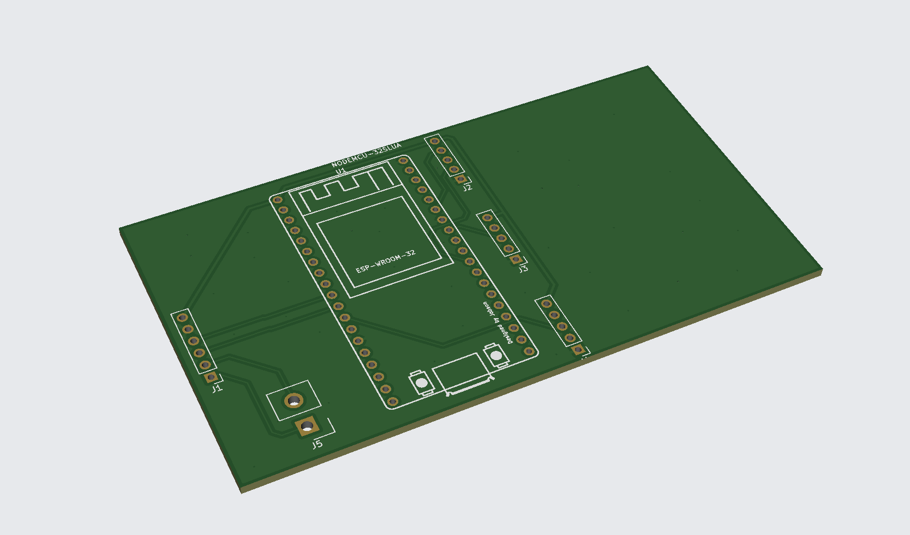

# G-BungE Dashboard ESP32

This project is an ESP32-based dashboard for the final Baja vehicle, Mk.5.
It aims to display vehicle status on 4-digit 7-segment modules using CAN data from the Sevcon Gen4 Size 6 controller.

Firmware and hardware resources for the G-BungE Mk.5 Baja EV dashboard.



## Project Layout

```text
Firmware/
  main/
    main.ino

  test/
    ledsegmentcheck/
      ledsegmentcheck.ino

    soc_can_display/
      soc_can_display.ino

Hardware/
  README.md

  PCB KiCAD files/
    009_GBdashboard.kicad_pcb
    009_GBdashboard.kicad_pro
    009_GBdashboard.kicad_sch

    gerber/
      009_GBdashboard.zip
      info.md

  STEP files/
    DashBoard PLA Housing.step

  images/
    dashboard-pcb-preview.png
```

## Firmware

- `Firmware/main/main.ino`: main dashboard sketch for the Mk.5 vehicle
- `Firmware/test/ledsegmentcheck/ledsegmentcheck.ino`: basic check sketch for three 7-segment modules and CAN communication
- `Firmware/test/soc_can_display/soc_can_display.ino`: test sketch for displaying SoC, temperature, and voltage values received over CAN

## Hardware

- Controller: NodeMCU ESP32-S
- CAN transceiver: SN65HVD230
- Display: 4-digit 7-segment module x3
- PCB source: `Hardware/PCB KiCAD files/009_GBdashboard.kicad_pcb`, `Hardware/PCB KiCAD files/009_GBdashboard.kicad_sch`, `Hardware/PCB KiCAD files/009_GBdashboard.kicad_pro`
- Manufacturing export: `Hardware/PCB KiCAD files/gerber/009_GBdashboard.zip`
- 3D PLA housing: `Hardware/STEP files/DashBoard PLA Housing.step`

## Pin Map

### 7-Segment Display

| Part | SCLK | RCLK | DIO |
| --- | --- | --- | --- |
| SEG1 | GPIO21 | GPIO22 | GPIO17 |
| SEG2 | GPIO18 | GPIO19 | GPIO23 |
| SEG3 | GPIO13 | GPIO14 | GPIO25 |

### CAN

| Part | ESP32 Pin |
| --- | --- |
| CAN TXD / CTX | GPIO26 |
| CAN RXD / CRX | GPIO27 |

## CAN / Display Behavior

- CAN bus speed: 500 kbps
- Main sketch polls the Sevcon controller over CANopen SDO.
- Display 1 shows motor speed in rpm.
- Display 2 shows motor temperature in degrees Celsius.
- Test sketches are kept for segment wiring checks and CAN receive/display checks before vehicle installation.

## Notes

- Main firmware is built around the Sevcon Gen4 Size 6 controller used in the Mk.5 Baja EV.
- CAN bus termination should be 120 ohm only at each end of the bus.
- Segment display polarity can be adjusted in each sketch with `SEGMENT_ACTIVE_LOW`, `DIGIT_ACTIVE_HIGH`, and `SEND_SEGMENTS_FIRST`.
- Hardware PCB files were added under `Hardware/` for Mk.5 dashboard fabrication and reference.
